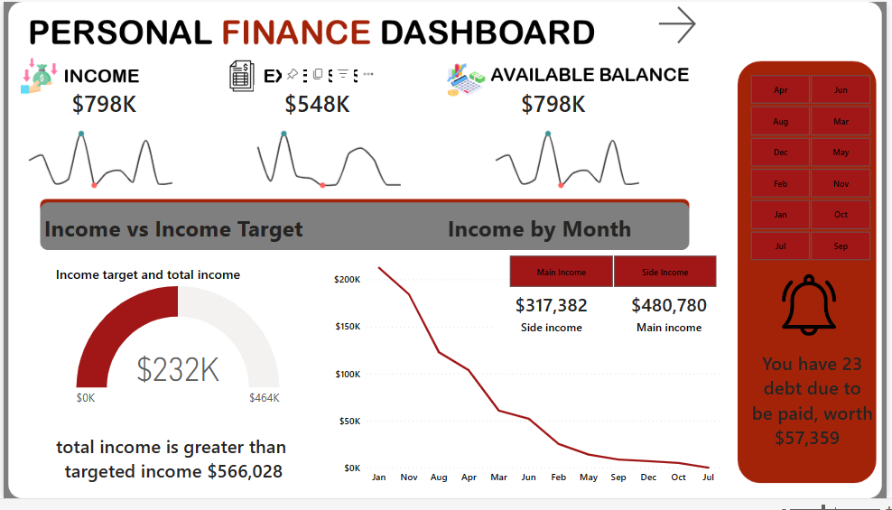
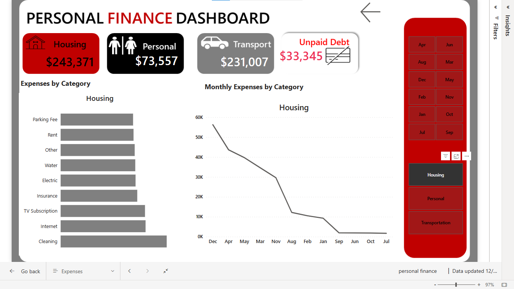

# Personal_finance_dashboard

# INTRODUCTION
This is a powerbi project on personal finance for a fictious company. Its looks as the total Income from both the Main and Side Income as well as the Expenses, the dash board also tells us the total debts accrued for each month.

# The report comprises of two pages:
1. The income
2. The expenses

The initial dashboard focuses on income, presenting the total amount derived from both Main and side Income. Additionally, it displays the months in which the income targets were achieved, utilizing a slicer for easy identification. According to my analysis, five months— December, July, May, September, and October failed to reach the targeted income.

The second dashboard focuses on aggregating expenses across personal, transportation, and housing categories. It also computes the cumulative debt accrued, with the added functionality of being filterable through the use of a slicer.

To interact with the dashboard click [here](https://app.powerbi.com/groups/me/reports/8ae5cc09-364c-471c-a256-8352ce34221b/ReportSection6a2a9b6a71499367a8b5?experience=power-bi&clientSideAuth=0)

